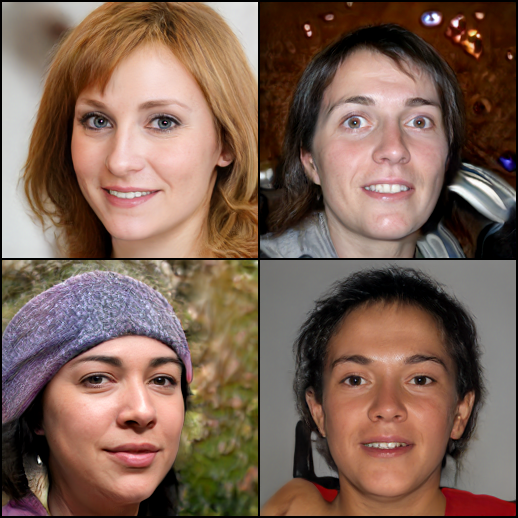

# StyleGAN2 in PyTorch

A clean, modular, and optimized PyTorch implementation of the **StyleGAN2** architecture for high-quality image generation. This repository contains the complete codebase for training the model from scratch, as well as running fast inference using the best pre-trained checkpoint weights.

This implementation successfully addresses key limitations of the original StyleGAN:
1. **No AdaIN Artifacts:** Replaces Adaptive Instance Normalization (AdaIN) with runtime weight modulation and demodulation, completely eliminating "water-droplet" artifacts.
2. **Smooth Training Without Progressive Growing:** Replaces progressive structure growing with skip connections in the Generator and residual connections in the Discriminator, ensuring stable training directly at the final resolution while resolving phase alignment artifacts (e.g., rigid teeth/eyes).
3. **Lazy Regularization:** Incorporates computationally efficient R1 regularization for the Discriminator and Perceptual Path Length (PPL) regularization for the Generator.



<p align="center">
  <em>for truncation =  0.6.</em>
</p>
---

## Project Structure

```bash
├── models.py      # Core network components (Modulated Conv, Generator, Discriminator)
├── losses.py      # GAN loss functions, R1 regularization, and PPL regularization
├── train.py       # Full training pipeline with CLI options and FID logging
├── generate.py    # Image generation inference script with the truncation trick
├── invert.py      # GAN Inversion tool (project custom images into latent space)
├── weights/       # Directory containing pre-trained weights
│   └── best_checkpoint_1010k.pth
└── output/        # Default directory for generated images
```

---

## Installation & Setup

1. **Clone the repository:**
   ```bash
   git clone https://github.com/pixelrahulnotfound/stylegan2-implementation/
   cd gans
   ```

2. **Install dependencies:**
   Make sure you have PyTorch and Torchvision installed. You can install the remaining requirements via:
   ```bash
   pip install tqdm pillow numpy matplotlib torchmetrics
   ```

---

## Quick Start: Generating Images

You can generate images instantly using the pre-trained checkpoint weights included in the `weights/` directory.

### Basic Generation
Generate a grid of 16 images using default settings (recommends CUDA if available):
```bash
python3 generate.py
```

### Advanced Inference Options
Customize the generation using command line arguments:
```bash
python3 generate.py \
    --weights weights/best_checkpoint_1010k.pth \
    --output_dir output \
    --num_images 16 \
    --truncation 0.7 \
    --seed 42 \
    --device cuda
```

### Argument Reference:
* `--weights`: Path to the generator checkpoint.
* `--output_dir`: Directory to save generated images.
* `--num_images`: Number of images to generate (default: 16).
* `--truncation`: Truncation factor for the truncation trick (values between 0.0 and 1.0; default: 0.7. Lower values increase image quality and fidelity at the expense of variety).
* `--seed`: Set a random seed for reproducible image generation.
* `--grid`: Boolean flag. If `True` (default), saves all generated images as a single combined grid. If `False`, saves each image individually.
* `--device`: Force a specific device (e.g., `cuda`, `mps`, `cpu`).

---

## Training on a Custom Dataset

To train the model on your own dataset (e.g., FFHQ or custom faces):

1. **Prepare your dataset:**
   Organize your dataset folder in the PyTorch `ImageFolder` structure:
   ```bash
   dataset/
   └── class_name/
       ├── img1.png
       ├── img2.png
       └── ...
   ```

2. **Run the training script:**
   ```bash
   python3 train.py --data_path /path/to/dataset --batch_size 16 --lr 0.0025 --total_iters 1000000
   ```

### Training Argument Reference:
* `--data_path`: Path to the dataset root folder.
* `--checkpoints_dir`: Folder where checkpoints and image samples will be saved.
* `--batch_size`: Batch size (default: 16).
* `--lr`: Learning rate (default: 0.0025).
* `--latent_dim`: Latent space dimensionality (default: 512).
* `--total_iters`: Total training iterations.
* `--eval_freq`: Iteration interval for calculating FID and saving checkpoints.
* `--resume`: Path to a checkpoint `.pth` file to resume training.

---

## GAN Inversion (Image Projection)

To find the latent code $w$ that reconstructs a specific target face photo, you can run the GAN Inversion script. This projects target images into the StyleGAN2 $W^+$ latent space using a robust, multi-stage optimization procedure:

1. **Automatic Alignment & Cropping:** Automatically detects, centers, crops, and pads the face using OpenCV Haar Cascades to match the FFHQ data distribution.
2. **Fixed & Optimizable Noise:** Fixes synthesis noise maps during projection to stabilize latent optimization, with support to optionally optimize noise parameters for pixel-perfect detail reconstruction.
3. **Corrected Perceptual Loss:** Rescales and normalizes generator/target images with ImageNet mean and std statistics for precise VGG feature-gradient backpropagation.
4. **Enhanced Optimization Strategy:** Combines L1 loss, MSE loss, and perceptual loss under a Cosine Annealing learning rate schedule, regulated by W+ space variance constraints to keep style layers on the realistic face manifold.

### Running Inversion

Basic face alignment and projection (standard):
```bash
python3 invert.py --target /path/to/target_face.png --steps 1000 --lr 0.05
```

High-fidelity projection (optimizing noise maps for fine details like hair):
```bash
python3 invert.py --target /path/to/target_face.png --steps 1000 --optimize_noise
```

### Inversion Argument Reference:
* `--target`: Path to the target image (required).
* `--weights`: Path to pre-trained weights (default: `weights/best_checkpoint_1010k.pth`).
* `--output_dir`: Directory to save reconstruction results and latent codes (default: `output`).
* `--steps`: Number of optimization steps (default: 1000).
* `--lr`: Optimizer learning rate (default: 0.05).
* `--no_align`: Flag to disable automatic face alignment/cropping (use when input is already pre-cropped).
* `--padding_ratio`: Face crop padding ratio to frame the head (default: 2.0).
* `--optimize_noise`: Enable optimization of generator noise maps along with latent codes.
* `--reg_w`: Latent variance regularization weight across layers in $W^+$ space (default: 1.0).
* `--device`: Force device selection (`cuda`, `mps`, `cpu`).

### Google Colab Troubleshooting
If you run into an `AttributeError: module 'cv2' has no attribute 'CascadeClassifier'` on Colab, it means a dummy library shadows OpenCV. Fix it by running:
```bash
!pip uninstall -y cv2 opencv-python-headless
!pip install opencv-python
```

### ⚠️ Current Limitations & Future Roadmap
> [!WARNING]
> **Experimental Feature:** GAN inversion in this codebase is currently experimental. While the added face alignment and noise-fixing mechanisms improve outcomes, the optimization can still produce artifacts or fail to match identity perfectly due to limitations in optimizing directly in $W^+$ space from random or average initializations.

**Roadmap to Make Inversion Work Properly:**
1. **Train a Feed-Forward Encoder:** Implement a pre-trained Encoder network (like *pixel2style2pixel* or *e4e*) to predict the initial latent code $w$ from the target image in a single pass. This provides a near-perfect initialization, which can then be fine-tuned via optimization.
2. **Keypoint-Based Affine Alignment:** Replace the simple bounding box crop with eye/nose keypoint-based affine warping (using dlib or MTCNN) to align eyes and mouth perfectly to the FFHQ layout.
3. **Advanced Perceptual Metrics:** Integrate LPIPS (Learned Perceptual Image Patch Similarity) instead of raw intermediate VGG features for cleaner human-visual similarity gradients.
4. **StyleGAN2-ADA / StyleGAN3 Upgrades:** Integrate adaptive data augmentation or translation-invariant architectures to make the generator manifold more robust.

---

## License

This project is licensed under the MIT License.
